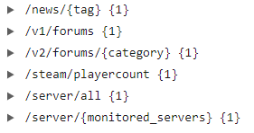

#  UNOFFICIAL REST API FOR LOST ARK
An Unofficial REST API for [LOST ARK](https://www.playlostark.com/en-us/news), Created by [Andre Saddler](https://github.com/axsddlr)

### Features
This REST API provides you with some useful tools such as:
- Server Status
- Latest News
- Forum topics and specific Forums

### Endpoints

### Hosts:
[https://lost-ark-api.vercel.app](https://lost-ark-api.vercel.app/)

[http://lostarkapi.herokuapp.com/](http://lostarkapi.herokuapp.com/)

[https://lastarkapi-m2.herokuapp.com/](https://lastarkapi-m2.herokuapp.com/)
&nbsp;
&nbsp;

